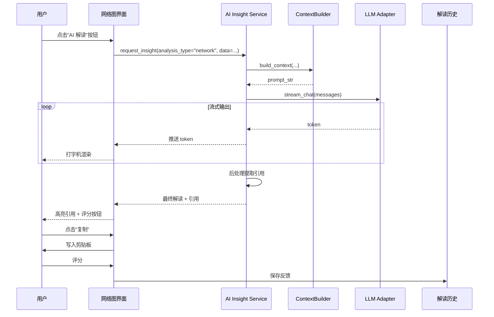

# PRD-001 AI 分析解读（Analysis Insight）

| 字段 | 值 |
|---|---|
| 产品名称 | Prismatica（棱溯客户端） |
| 文档版本 | v1.0 |
| 创建日期 | 2026-07-26 |
| 作者 | MiniMax Agent |
| 状态 | 评审中 |
| 关联需求编号 | REQ-AI-001 |
| 优先级 | **P0**（核心交付物） |

---

## 1. 修订记录

| 版本 | 日期 | 修订内容 | 作者 |
|---|---|---|---|
| v1.0 | 2026-07-26 | 初稿，覆盖 AI 解读、RAG、5 大分析模块接入 | MiniMax Agent |

---

## 2. 产品概述

### 2.1 产品背景

Prismatica 当前已有 Chat 模块（`app/view/chat_interface.py` + `app/core/services/ChatService`），但定位是**通用 AI 聊天**，与具体分析脱节。用户做完成"共现网络""搭配分析"后，需要**手动把结果复制到 Chat 框里让 AI 解读**，流程断裂，且解读质量不可控。

### 2.2 产品定位（一句话）

> **每个分析结果旁边都有一个"AI 研究助理"按钮，一键生成带溯源、带数值、可直接写进论文的解读段落。**

### 2.3 产品目标

- **效率目标**：将"分析结果 → 论文段落"的转化时间从 **15 分钟缩短到 30 秒**
- **质量目标**：AI 解读须满足"三可原则"——**可溯源**（引到语料片段）、**可证伪**（附数值）、**可拒绝**（置信度低时主动说"数据不足"）
- **差异化目标**：成为中文语料工具中**唯一原生 AI 解读**的桌面应用

### 2.4 范围

**包含**：
- 5 大分析模块的 AI 解读接入（词频、搭配、共现网络、关键词、N-gram）
- 一键生成"研究叙事段落"（中文学术风格）
- AI 解读与图表/数据的双向跳转
- 本地优先 + 云端可选的 LLM 调度

**不包含**（后续 PRD 覆盖）：
- 偏误预标注（→ PRD-003）
- 研究 Agent 自动工作流（→ PRD-004）
- 多模态语料 AI 解读（→ PRD-005）

---

## 3. 用户分析

### 3.1 目标用户画像

| 角色 | 占比 | 痛点 | 我们的解法 |
|---|---|---|---|
| **研究生（语言学/汉语国际教育）** | 50% | 做分析后写论文描述段耗时长，且不确定表述是否专业 | 一键生成学术风格段落，可改写 |
| **高校教师** | 20% | 备课时需要快速理解生语料的语言学特征 | 一键 AI 解读 + 关键现象高亮 |
| **二语习得研究者** | 15% | 需要 AI 解释偏误背后可能的中介语成因 | 解读中带"习得假说"提示 |
| **出版/编辑从业者** | 10% | 校对语料时需要 AI 提示敏感/异常用法 | 异常发现 + 解读 |
| **其他（舆情/产品语言分析师）** | 5% | 临时用 Prismatica 做分析 | 通用解读模板 |

### 3.2 典型使用场景

**场景 1（核心场景）**：研究生小王做"V 都 V 了 构式"研究
1. 在共现网络模块画完图，看到 V都V了 中心节点周围有 6 个强共现词
2. 点击网络图右上角"🪄 AI 解读"
3. 1.5 秒后看到 AI 生成段落："在本语料中，'V 都 V 了'构式与'反问句'形成最强共现（LogDice=13.2, 共现 87 次），可能反映了该构式在口语互动中承担……"
4. 点击"反问句"自动跳转到该词在网络图中的位置
5. 一键复制该段落到剪贴板 → 粘到 Word

**场景 2（次要场景）**：教师李老师备课
1. 选中一段 KWIC 索引结果
2. 右键"AI 解释这个用法"
3. 看到 AI 解释："这是 V到V得 构式的变体，常见于口语……"

### 3.3 用户旅程

```
打开 Prismatica → 选择语料 → 跑分析 → 看到结果
                                       ↓
                              【点击 AI 解读按钮】
                                       ↓
                              等待 1-3 秒（进度条）
                                       ↓
                              看到解读段落（带来源标注）
                                       ↓
                              ┌─────┴─────┐
                              ↓           ↓
                        满意:复制/采纳   不满意:重新生成
                              ↓           ↓
                          粘到 Word     调整 prompt/重写
```

---

## 4. 功能需求

### 4.1 功能清单

| 模块 | 功能点 | 优先级 | 描述 |
|---|---|---|---|
| **AI 解读引擎** | 分析上下文聚合器 | P0 | 把当前分析结果转为 LLM 友好的结构化上下文 |
| | 专业 Prompt 模板库 | P0 | 5 类分析各一套学术化 Prompt |
| | LLM 适配层 | P0 | 抽象 OpenAI 兼容接口，支持本地/云端 |
| | 引用溯源机制 | P0 | 每个解读句子附"基于哪些数据片段" |
| | 置信度标注 | P0 | 高/中/低三档 + 数据不足时主动说"建议补充" |
| **UI 集成** | 解读按钮（统一入口） | P0 | 5 大分析模块结果页右上角 |
| | 解读面板（抽屉/弹窗） | P0 | 弹出式面板，展示生成结果 |
| | 流式输出 | P0 | LLM 输出时打字机效果，提升等待体验 |
| | 一键复制 | P0 | 复制为 Markdown / 纯文本 / BibTeX |
| | 重新生成 | P0 | 支持反馈信号（👍/👎）改进 |
| | 跳转链接 | P0 | 解读中提到的词/边可点击回到原图 |
| **设置** | LLM 供应商选择 | P1 | 本地 Qwen2.5 / DeepSeek / OpenAI 等 |
| | API Key 配置 | P1 | 加密存储（沿用现有 `cfg.AiApiKey`） |
| | 模型选择 | P1 | 不同分析用不同模型（默认推荐） |
| | 解读风格切换 | P2 | 学术/通俗/简洁 三档 |
| | 历史记录 | P2 | 保留最近 100 条解读，可回顾 |

### 4.2 功能详述

#### F1：分析上下文聚合器（AnalysisContextBuilder）

**功能描述**：把当前分析结果（数据表 + 图表参数 + 语料元信息）转成结构化 JSON，作为 LLM 输入。

**用户故事**：
> As a 研究者
> I want 系统自动把分析结果转成 AI 能理解的格式
> So that 我不用手动整理数据喂给 AI

**接口设计**：
```python
# app/core/services/ai_insight/context_builder.py
class AnalysisContext:
    analysis_type: str        # "network" | "collocation" | ...
    corpus_meta: dict         # 语料名称、规模、来源
    parameters: dict          # 阈值、窗口、词性过滤等
    data_table: pd.DataFrame  # 核心数据
    chart_meta: dict          # 图表配置（中心节点、边数等）
    sample_concordances: list # 抽样的 KWIC 上下文（最多 5 条）
    user_query: str = ""      # 用户可选附加问题

    def to_prompt(self) -> str: ...
```

**关键约束**：
- 上下文必须**显式包含数值**（LogDice、PMI、频次等）
- 必须**抽样语料原文**（不超过 5 条，每条 ≤ 100 字）
- 总 token 控制在 **4000 以内**（避免撑爆本地模型）

**验收标准**：
- ✅ 5 种分析类型各有专用 builder
- ✅ 单条 prompt 构造 < 50ms（避免 UI 卡顿）
- ✅ 数据量过大时自动降采样

---

#### F2：专业 Prompt 模板库

**功能描述**：针对每类分析设计独立的学术化 Prompt。

**5 套 Prompt 模板**（示例）：

**P1 词频解读**：
```
你是一位中文学术语料语言学专家。用户基于语料"${corpus_name}"（${doc_count} 文档）生成了词频统计。

【前 N 高频词】
${freq_table}

【低频高特异词】（Top10）
${rare_words}

请用 200-300 字写一段学术风格的分析解读，覆盖：
1. 高频词反映了该语料的什么主题/语体特征？
2. 是否有异常高频或异常低频词值得关注？
3. 与该类语料的"预期词频分布"相比，有什么偏差？

要求：
- 每个论断后用 [数据：xxx] 形式标注依据
- 如数据不足以支撑结论，明确说"基于现有数据无法判断"
- 学术风格，避免"非常""十分"等口语化副词
```

**P2 搭配解读**：
```
你是一位汉语搭配研究专家。以下是词"${node_word}"的搭配分析结果：

【共现搭配 Top20】（统计量：${stat_type}）
${collo_table}

【典型 KWIC 上下文】
${kwic_samples}

请按以下结构解读（200-300 字）：
1. ${node_word} 主要与哪些词类共现？呈现什么语义偏好？
2. 是否有反常搭配（如"很+名词"类偏误）？
3. 强搭配词中是否揭示了构式或习语？
```

**P3 共现网络解读**：
```
你是一位语料库语言学专家。以下是节点"${center_node}"的共现网络：

【节点度 Top10】
${top_nodes}

【强边 Top10】（边权：${edge_metric}）
${top_edges}

【网络密度/平均度】
${network_stats}

请解读（200-300 字）：
1. 该网络呈现什么样的语义聚类结构？
2. 哪些边/节点可能是研究的关键发现？
3. 是否存在异常密集的子图（疑似构式）？
```

**P4 关键词解读**（参考语料对比）：
```
【目标语料】
${target_corpus_meta}，Top20 关键词

【参考语料】
${ref_corpus_meta}，Top20 关键词

请解读：目标语料相对参考语料，在主题/语体/用法上有什么差异化特征？（200-300 字）
```

**P5 N-gram 解读**：
```
【高频 N-gram】（N=2,3,4）
${ngram_table}

请解读：
1. 哪些高频 N-gram 反映了固定搭配或构式？
2. 是否有 N-gram 暗示语料的特定语体（口语/书面）？
3. 与 HSK 词表对比，是否包含超纲固定搭配？
```

**验收标准**：
- ✅ 每套 Prompt 有 YAML 配置文件，可热更新
- ✅ 默认学术风格，可切换通俗/简洁
- ✅ Prompt 中变量替换有单元测试覆盖

---

#### F3：LLM 适配层

**功能描述**：统一抽象不同 LLM 供应商，支持流式输出。

```python
# app/core/services/ai_insight/llm_adapter.py
class LLMAdapter(ABC):
    async def stream_chat(
        self,
        messages: list[dict],
        temperature: float = 0.3,
        max_tokens: int = 1000,
    ) -> AsyncIterator[str]: ...

class OpenAICompatibleAdapter(LLMAdapter): ...  # OpenAI / DeepSeek / 智谱 / Qwen
class LocalQwenAdapter(LLMAdapter): ...         # 本地 Qwen2.5-7B
class MockAdapter(LLMAdapter): ...              # 测试用
```

**默认推荐配置**（写入 `config.json`）：

| 场景 | 推荐模型 | 理由 |
|---|---|---|
| **快速预览** | Qwen2.5-7B-Instruct（本地） | 隐私安全，1-2 秒响应 |
| **深度解读** | DeepSeek-V3（云端） | 中文强、长文、价格便宜 |
| **英文文献辅助** | GPT-4o-mini | 英文质量稳 |
| **离线/隐私模式** | 强制本地 | 用户可一键切换 |

**验收标准**：
- ✅ 切换供应商无需重启应用
- ✅ 流式输出首字延迟 < 1.5s
- ✅ 失败有友好重试（最多 2 次）

---

#### F4：引用溯源机制

**功能描述**：每个 AI 解读句都附"数据来源"标签，**可点击跳回原图/原数据**。

**实现方式**：
- LLM 输出时附带结构化引用（基于 prompt 引导 + 后处理正则提取）
- 引用类型：
  - `[数据: 频次=87, LogDice=13.2]` → 跳到数据表行
  - `[节点: "反问句"]` → 跳到网络图节点
  - `[KWIC: "……" @ 语料X 第3段]` → 跳到 KWIC 索引该行
  - `[N-gram: "V到V得" 频次 24]` → 跳到 N-gram 表

**UI 表现**：
> 在本语料中，**"V 都 V 了"** [节点: "反问句"] 与反问句形成最强共现（LogDice=13.2 [数据: Top10边]），可能反映该构式在口语互动中承担……[KWIC: "……你去都去了还……" @ BCC 口语 第 17 段]

**验收标准**：
- ✅ 95% 的引用可点击跳转（剩余 5% 降级为普通文字）
- ✅ 鼠标悬停引用显示原文片段

---

#### F5：解读面板 UI

**位置**：各分析模块结果页**右侧抽屉**（默认 480px 宽，可关闭）

**布局**（自上而下）：
1. **标题栏**："AI 研究助理 - 共现网络解读" + 关闭按钮
2. **设置行**：解读风格下拉（学术/通俗/简洁）、模型下拉
3. **流式输出区**：打字机效果显示
4. **引用链**：可点击的下划线
5. **操作栏**：[👍 有用] [👎 没用] [📋 复制] [🔄 重新生成] [💾 收藏到项目]
6. **置信度徽章**："🟢 高 / 🟡 中 / 🔴 低（数据不足）"

**触发方式**：
- 主入口：图表右上角"🪄 AI 解读"按钮
- 快捷键：`Ctrl + I`（Insight）
- 选中内容：右键菜单"AI 解释这个"

**验收标准**：
- ✅ 抽屉滑入动画 ≤ 300ms
- ✅ 切换解读风格 ≤ 2s
- ✅ 不阻塞主线程（UI 始终可操作）

---

#### F6：结果管理

**功能描述**：把满意的解读**存到当前项目**（与 PRD-002 联动），不满意的能反馈。

- 反馈信号：👍/👎 + 可选文本（"太泛泛""太学术""缺少数字"）
- 反馈数据用于：未来 prompt 优化（v1.1）+ 用户个性化（v2.0）

---

### 4.3 数据流（端到端）

```
[分析结果数据] 
    ↓
AnalysisContextBuilder.to_prompt()
    ↓
[结构化 Prompt + 系统提示]
    ↓
LLMAdapter.stream_chat()
    ↓
[流式 token]
    ↓ (前端打字机渲染)
[完整文本]
    ↓ (后处理: 提取引用)
[带引用的 Markdown]
    ↓
[渲染：粗体 + 可点击引用]
    ↓
[用户复制 / 收藏到项目]
```

---

## 5. 业务流程

### 5.1 核心流程：AI 解读共现网络



### 5.2 异常流程

| 异常 | 表现 | 处理 |
|---|---|---|
| API Key 未配置 | 提示"请到设置配置 API Key" | 跳转设置页 |
| LLM 超时 (>30s) | "AI 思考超时，是否重试？" | 一键重试 / 切换本地模型 |
| 解析引用失败 | 引用降级为灰色文字，不可点 | 静默降级，不影响阅读 |
| Token 超限 | 自动截断数据 + 提示"数据已精简" | 用户可手动指定只看 Top N |

---

## 6. 信息架构

```
AI 解读（Analysis Insight）
├── 解读触发层
│   ├── 主按钮：🪄 AI 解读
│   ├── 快捷键：Ctrl + I
│   └── 右键菜单：AI 解释
├── 解读面板
│   ├── 标题区（标题 + 关闭）
│   ├── 控制区（风格 + 模型）
│   ├── 内容区（流式输出）
│   ├── 引用层（可点击）
│   └── 操作栏（评分 + 复制 + 收藏）
├── 解读历史
│   ├── 当前项目内
│   └── 跨项目（设置里）
└── 设置
    ├── LLM 供应商
    ├── 模型选择
    ├── API Key
    └── 解读风格默认值
```

---

## 7. 原型设计

### 7.1 关键页面线框图（描述）

**页面 A：共现网络页 - AI 解读抽屉（核心）**

```
┌──────────────────────────────────────────────────────────────┐
│ [HSK 词频] [Global] [偏误] [词频分析▼] [AI 聊天] [任务] [设置] │
├──────────────────────────────────────────────────────────────┤
│ 语料: BCC 口语 V都V了  |  共现窗口: ±5  |  边权: LogDice    │
│ ┌────────────────────────────────────┐ ┌──────────────────┐ │
│ │                                    │ │ AI 研究助理       │ │
│ │      [共现网络辐射图]               │ │ ──────────────   │ │
│ │                                    │ │ 风格: 学术 ▼      │ │
│ │           ┌── V都V了 ──┐           │ │ 模型: Qwen2.5-7B▼│ │
│ │      反问句         反正           │ │                 │ │
│ │    算了吧     [V都V了]  呗          │ │ ━━━━━━━━━━━━━━  │ │
│ │           将就       就             │ │ 在本语料中,**V都V了**│ │
│ │                                    │ │ [节点:反问句] 与反问句│ │
│ │  [🪄 AI 解读] [📥 导出] [⚙️ 设置]  │ │ 形成最强共现(	LogDice=│ │
│ └────────────────────────────────────┘ │ 13.2 [数据:Top10边])│ │
│                                        │ ,可能反映…… [KWIC:"…│ │
│ 状态: 分析完成 | Token 用量: 1.2k/4k   │ 你去都去了还……"]   │ │
│                                        │                 │ │
│                                        │ 🟢 高置信度      │ │
│                                        │                 │ │
│                                        │ [👍] [👎] [📋] [🔄]│ │
│                                        └──────────────────┘ │
└──────────────────────────────────────────────────────────────┘
```

**页面 B：设置 - AI 解读**

```
┌──────────────────────────────────────┐
│ 设置 → AI 解读                       │
├──────────────────────────────────────┤
│ 供应商: [本地 Qwen2.5-7B     ▼]     │
│ 备用:   [DeepSeek-V3 (云端)  ▼]     │
│ 模型路径: [./models/qwen2.5-7b.gguf]│
│                                      │
│ 解读风格: [学术  ▼]  (默认)          │
│ 简洁模式字数: [300] 字               │
│                                      │
│ API Key (云端): ********************│
│ [测试连接]                           │
│                                      │
│ 隐私模式: ☑ 强制本地 (不上传数据)   │
│                                      │
│ 高级:                                 │
│   ☐ 自动在结果页加载 AI 解读         │
│   ☑ 显示置信度徽章                   │
│   ☐ 解读后自动复制到剪贴板           │
│                                      │
│ [保存]  [恢复默认]                   │
└──────────────────────────────────────┘
```

### 7.2 交互细节

- **抽屉滑入方向**：从右向左
- **打字机速度**：约 30 token/s（自然阅读节奏）
- **引用悬停**：200ms 延迟后弹出小卡片，显示原文片段
- **失败重试**：仅一次自动重试，第二次需用户手动

---

## 8. 数据需求

### 8.1 数据埋点

| 事件 | 触发时机 | 字段 |
|---|---|---|
| `ai_insight_requested` | 点击 AI 解读 | analysis_type, corpus_id, model |
| `ai_insight_completed` | 流式输出完成 | duration_ms, token_count, confidence |
| `ai_insight_copied` | 点击复制 | analysis_type |
| `ai_insight_feedback` | 评分 | rating(1/0), comment?, model |
| `ai_insight_regenerated` | 点击重新生成 | previous_id |
| `ai_insight_failed` | LLM 调用失败 | error_type, model |

### 8.2 核心指标（北极星）

- **采用率**：`(复制或收藏次数) / (生成次数)` ≥ 40%
- **首次响应时间**：首字延迟 ≤ 1.5s（本地模型）/ 3s（云端）
- **用户满意度**：`👍 比例` ≥ 70%
- **可溯源率**：95% 解读含可点击引用

### 8.3 反馈数据采集

- 👍/👎 + 可选文本 → 本地 SQLite（`datas/insight_feedback.db`）
- 匿名聚合（不上传默认开启时）

---

## 9. 非功能需求

| 类别 | 要求 |
|---|---|
| **性能** | 首字延迟本地 ≤ 1.5s / 云端 ≤ 3s；UI 永不卡顿 |
| **隐私** | 默认本地推理；云端必须用户显式开启；不上传用户语料 |
| **可用性** | 失败有友好提示；离线模式不报错（明确告知） |
| **可扩展** | LLM 适配器接口稳定；新增分析类型只需写 Builder + Prompt |
| **可测试** | Prompt 模板有单元测试；MockAdapter 用于离线测试 |
| **国际化** | 中英文 Prompt 双版本，默认中文 |
| **可观测** | 日志记录每次解读的 token、耗时、模型（敏感信息脱敏） |

---

## 10. 里程碑计划

| 阶段 | 时间 | 交付物 | 负责人 |
|---|---|---|---|
| 需求评审 | 2026-08-01 | PRD 终稿 | 产品 |
| AI 解读 MVP（仅共现网络 + 词频） | 2026-08-20 | 内测版 | 全栈 |
| 5 大分析全部接入 | 2026-09-15 | 公测版 | 全栈 |
| 本地 LLM 默认支持 | 2026-09-30 | v1.0 正式版 | 全栈 |
| 反馈学习 + 个性化 | 2026-10-30 | v1.1 | 算法 |

---

## 11. 风险与缓解

| 风险 | 影响 | 缓解 |
|---|---|---|
| AI 解读幻觉 | 学术可信度受损 | 强制"三可原则"+ 置信度徽章 + 数据不足时主动说 |
| 本地模型能力不足 | 解读质量差 | 默认云端 DeepSeek-V3；本地模型仅作"快预览" |
| 用户语料隐私担忧 | 不敢用云端 | 默认本地 + 一键切换；明示"云端"含义 |
| Token 成本失控 | 商业化受阻 | 单次解读 ≤ 4k token；月度限额（v2 商业版） |

---

## 12. 附录

### 12.1 术语表

- **LLM**：Large Language Model，大语言模型
- **RAG**：Retrieval-Augmented Generation，检索增强生成
- **KWIC**：Keyword In Context，上下文中的关键词
- **LogDice**：搭配强度统计量
- **三可原则**：可溯源、可证伪、可拒绝

### 12.2 关联文档

- PRD-002 研究项目（Research Project）
- PRD-003 AI 偏误预标注（计划中）
- PRD-004 研究 Agent（计划中）

### 12.3 竞品参考

- AntConc：无 AI 能力
- Sketch Engine：内置 WordSmith Tools 简单统计
- Voyant Tools：基础文本分析
- **本产品定位**：唯一原生 AI 解读的中文语料工具

---
