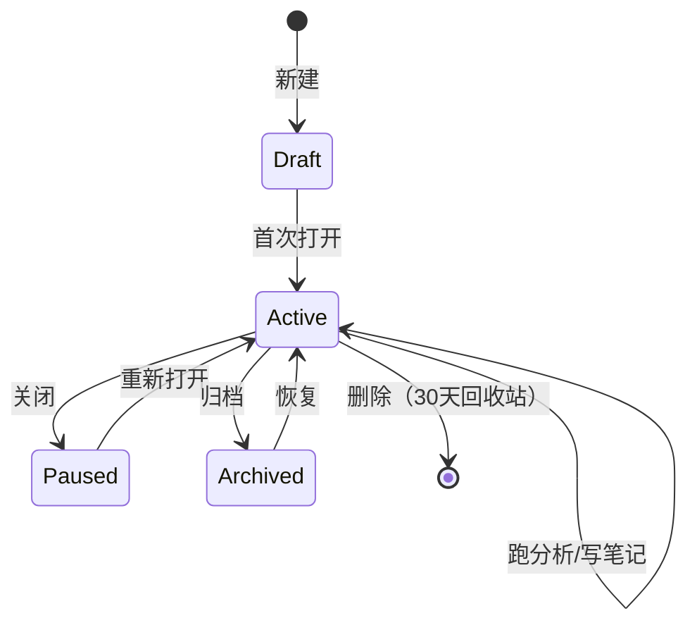
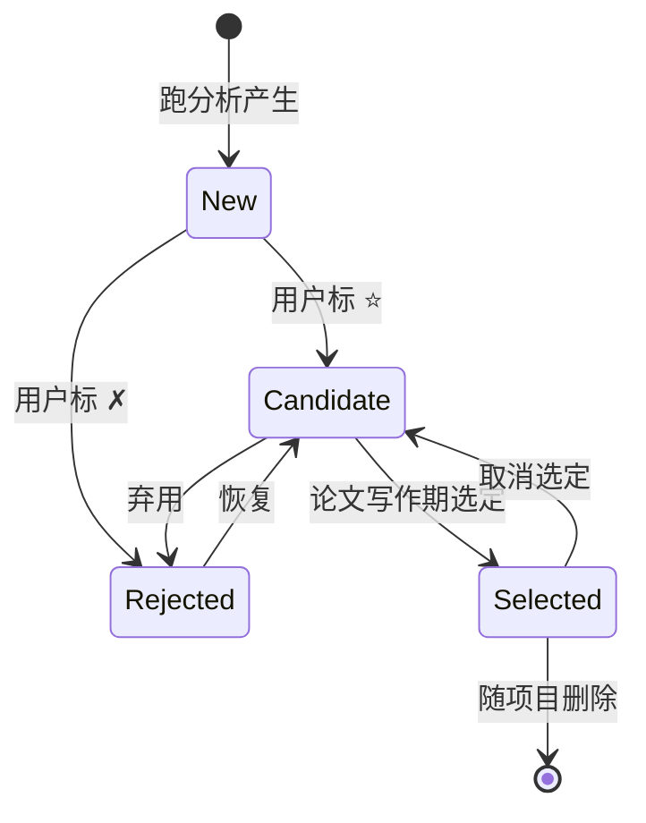

# PRD-002 研究项目（Research Project）

| 字段 | 值 |
|---|---|
| 产品名称 | Prismatica（棱溯客户端） |
| 文档版本 | v1.0 |
| 创建日期 | 2026-07-26 |
| 作者 | MiniMax Agent |
| 状态 | 评审中 |
| 关联需求编号 | REQ-PROJ-001 |
| 优先级 | **P0**（核心交付物） |
| 依赖 | PRD-001（AI 解读） |

---

## 1. 修订记录

| 版本 | 日期 | 修订内容 | 作者 |
|---|---|---|---|
| v1.0 | 2026-07-26 | 初稿，覆盖项目模型、UI、导出、与 AI 解读联动 | MiniMax Agent |

---

## 2. 产品概述

### 2.1 产品背景

当前 Prismatica 的工作模式是**"语料 + 临时分析"**：用户选一个语料，跑一个分析，看到结果，但**没有"研究项目"的概念**。存在以下痛点：

1. **找不到上次分析**：跑过的共现网络怎么找回？需重跑或翻历史
2. **配置丢失**：上次用的窗口大小、阈值、过滤器都忘了
3. **写作时拼凑**：写论文时要从多个分析结果里挑，过程痛苦
4. **数据与解读分离**：AI 解读的文字和分析结果不在一处

### 2.2 产品定位

> **"研究项目"是 Prismatica 的一等公民：把语料、分析配置、结果图表、笔记、AI 解读打包成一个可保存、可切换、可导出为论文素材的研究单元。**

### 2.3 产品目标

- **可找回**：100% 的分析结果可一键定位（按项目）
- **可复用**：项目模板（"中介语偏误分析模板"）可分享给他人
- **可写作**：一键生成"研究素材包"（Word/Markdown 形式），直接进论文
- **可演进**：项目支持版本化（v1 → v2 实验更新）

### 2.4 范围

**包含**：
- 项目模型（数据 + 行为）
- 项目侧边栏（切换 / 管理）
- 项目内分析结果"资源池"
- 笔记（Markdown 格式）
- AI 解读收藏（与 PRD-001 联动）
- 项目导出（论文素材包 / .prisma 文件）

**不包含**（后续 PRD）：
- 多人协作（→ PRD-006）
- 云端同步（→ PRD-007）

---

## 3. 用户分析

### 3.1 目标用户场景

| 场景 | 痛点 | 解决 |
|---|---|---|
| **开题阶段** | 跑了 N 个探索性分析，但只有少数能进入论文 | 项目内可标注"候选论文素材" |
| **写作阶段** | 写一段论述需要回查 5 个分析结果 | 项目内聚合所有相关结果 |
| **复现阶段** | 审稿人要求复现，怎么办 | 导出项目为 .prisma 文件 |
| **教学阶段** | 教师带学生，要给模板 | 项目模板分享 |
| **长期研究** | 论文周期 2 年，中间换电脑 | 项目文件可备份/恢复 |

### 3.2 用户画像

- **博/硕研究生（60%）**：研究跨度长，需管理多版本
- **高校教师（25%）**：带学生 + 自己研究
- **机构研究员（15%）**：课题制，需多人共享

### 3.3 关键用户旅程

```
立项 → 选语料 → 跑分析（多次）→ 标注候选 → 写笔记
                                              ↓
                                  AI 解读（自动归档到项目）
                                              ↓
                                  论文写作期：一键导出"素材包"
                                              ↓
                                  答辩/复现：导出 .prisma 文件
```

---

## 4. 功能需求

### 4.1 功能清单

| 模块 | 功能点 | 优先级 | 描述 |
|---|---|---|---|
| **项目模型** | 项目数据模型 | P0 | 元数据 + 内容容器 + 版本 |
| | 项目生命周期 | P0 | 创建 / 打开 / 关闭 / 删除 / 复制 |
| | 项目模板 | P1 | 内置模板 + 用户自定义 |
| **项目侧边栏** | 项目切换器 | P0 | 顶栏下拉 + 快捷键 |
| | 项目列表 | P0 | 全部项目列表 + 搜索 |
| | 项目右键菜单 | P0 | 重命名、复制、删除、导出 |
| **项目内资源** | 资源池（Resource Pool） | P0 | 自动收集所有分析结果 |
| | 资源标注 | P0 | 标记"候选素材 / 弃用 / 待定" |
| | 资源预览 | P0 | 图表缩略图 + 摘要文字 |
| | 资源跳转 | P0 | 一键回到原分析模块并定位 |
| **项目笔记** | 内置 Markdown 编辑器 | P0 | 项目级笔记 + 资源级笔记 |
| | 富文本 | P1 | 支持粗体、代码块、引用语料片段 |
| **AI 联动** | AI 解读自动归档 | P0 | 收藏的解读进入项目 |
| | AI 续写 | P2 | 选中笔记段落让 AI 续写 |
| **导出** | 论文素材包 | P0 | 选中的资源 + 笔记 → Word/Markdown |
| | 项目文件 | P0 | .prisma 完整导出（语料索引+配置+结果+笔记）|
| | BibTeX 引文 | P1 | 选中 KWIC 句子 → 引用条目 |

### 4.2 功能详述

#### F1：项目数据模型

**核心实体**：

```python
# app/core/services/project/models.py
@dataclass
class Project:
    id: str                          # UUID
    name: str                        # 项目名
    description: str                 # 一句话描述
    tags: list[str]                  # 标签，如 ["V都V了","中介语","口语"]
    created_at: datetime
    updated_at: datetime

    # 关联
    corpora_refs: list[CorpusRef]    # 引用哪些语料（不复制数据）
    resources: list[Resource]        # 分析结果集合
    notes: list[Note]                # 笔记集合
    ai_insights: list[AIInsight]     # AI 解读收藏

    # 元
    template: str | None             # 来源模板
    version: str                     # "1.0.0"
    schema_version: int              # 字段版本，便于升级

@dataclass
class CorpusRef:
    corpus_id: str                   # 引用注册表中的语料
    role: str                        # "target" / "reference" / "exploratory"
    note: str

@dataclass
class Resource:
    id: str
    type: str                        # "freq" | "concordance" | "network" | ...
    title: str                       # 用户可命名
    snapshot_path: str               # 分析结果快照文件路径
    thumbnail_path: str              # 缩略图路径
    summary: str                     # 200 字摘要（AI 生成 or 用户写）
    parameters: dict                 # 当时的分析参数（关键：可复现）
    tags: list[str]
    status: str                      # "candidate" | "selected" | "rejected" | "pending"
    created_at: datetime
    notes: list[Note]                # 资源级笔记

@dataclass
class Note:
    id: str
    content: str                     # Markdown
    resource_id: str | None          # None 表示项目级
    ai_generated: bool
    created_at: datetime
    updated_at: datetime

@dataclass
class AIInsight:
    id: str
    analysis_type: str
    content: str                     # 完整解读文本
    citations: list[Citation]        # 结构化引用
    confidence: str                  # "high" | "medium" | "low"
    model: str                       # 哪个模型生成的
    resource_id: str | None          # 关联到哪个分析结果
    created_at: datetime
```

**存储方案**：

```
datas/
├── projects/
│   ├── {project_id}/
│   │   ├── project.json          # Project 元数据
│   │   ├── resources/            # 资源快照（图表 PNG + 数据 CSV）
│   │   │   ├── freq_xxx.png
│   │   │   ├── network_yyy.graphml
│   │   │   └── data_zzy.csv
│   │   ├── notes/                # 笔记（Markdown）
│   │   ├── insights/             # AI 解读归档
│   │   └── thumbnails/           # 缩略图
```

**为什么不用单一 SQLite？**
- 资源（图表/数据）二进制文件多，单库压力大
- 项目文件夹便于用户**直接备份/拷贝**（用 Windows 资源管理器就能备份）
- 易于分享（压缩成 zip 即可）

**验收标准**：
- ✅ 项目数据 schema 有 Pydantic 校验
- ✅ 字段升级有 migration 机制
- ✅ 项目文件夹可独立备份

---

#### F2：项目切换器 UI

**位置**：主窗口**顶栏**右侧（紧邻设置图标）

**交互**：
- 点击下拉：项目列表（最近 5 个 + "更多…"）
- 切换项目 → 整个应用切换到该项目上下文
- 切换有 200ms 淡入淡出动画

**侧边栏模式**（可切换）：
- 顶栏下拉模式（默认）：节省空间
- 左侧栏模式（专家模式）：显示完整项目树

**验收标准**：
- ✅ 切换项目 < 500ms
- ✅ 最近项目按 `updated_at` 排序
- ✅ 项目有图标（不同类型模板不同色）

---

#### F3：项目仪表盘（首页）

用户打开项目后看到的**第一个页面**。

**布局**（三栏）：

```
┌─────────────────────────────────────────────────────────┐
│ 项目名: V都V了 构式研究 (口语)         [⚙️ 设置] [📤 导出]│
├──────────┬──────────────────┬──────────────────────────┤
│ 资源池   │ 资源详情/预览     │ 笔记 / AI 解读            │
│          │                  │                          │
│ 📊 词频  │ [大缩略图]        │ ## 研究问题              │
│ 🔗 搭配  │                  │ 探究 V都V了 在口语中……   │
│ 🌐 网络  │ **摘要**：        │                          │
│ ⭐ 关键词│ 强共现词反问句…  │ - 候选章节 3.2            │
│ 📝 Ngram │                  │ - 配图表：网络+搭配       │
│          │ 参数:             │                          │
│ 12 个资源 │ 窗口=5, 阈值=11  │ > 引用：[网络_反问句.png]│
│ 候选 3 个 │                  │                          │
│          │ [📋 复制摘要]      │ [+ 新笔记]               │
│          │ [🚀 跳转分析模块]  │ [🪄 AI 续写]            │
└──────────┴──────────────────┴──────────────────────────┘
```

**资源池交互**：
- 拖拽资源可改变顺序
- 双击 → 在右侧大图预览
- 状态徽章：⭐ 候选 / ✓ 选中 / ✗ 弃用 / ? 待定
- 多选 + 批量操作（标记、删除、导出）

---

#### F4：项目笔记（Markdown）

**编辑器**：
- 左侧编辑，右侧实时预览（可关闭预览）
- 支持 Markdown 语法 + 自定义短代码：
  - `[[resource:网络_反问句]]` → 插入资源引用块
  - `[[kwic:语料名/段号]]` → 插入 KWIC 上下文
  - `[[cite:项目名/资源名]]` → 插入引文

**笔记层级**：
- **项目级笔记**：整体研究问题、思路、参考文献
- **资源级笔记**：附在某个分析结果上的解读/评论

**AI 联动**（v1.1）：
- 选中笔记段落 → "AI 续写/润色"
- 选中笔记段落 → "AI 找反例/挑战"

**验收标准**：
- ✅ 编辑器响应 < 50ms（中文输入流畅）
- ✅ 资源引用点击后跳到原资源
- ✅ 笔记自动保存（每 5 秒）

---

#### F5：项目导出（论文素材包）

**触发**：项目仪表盘 → "📤 导出" → 弹窗选择导出内容

**导出格式 1：Word 文档（.docx）**
- 封面页：项目名、描述、创建者、日期
- 目录：按资源顺序
- 每个选中资源：
  - 资源标题
  - 缩略图
  - 参数记录
  - 数据表
  - AI 解读（如果存在）
  - 关联笔记
- 引用列表：BWIK / KWIC 引文

**导出格式 2：Markdown 压缩包（.zip）**
```
project_xxx.zip
├── README.md
├── resources/
│   ├── 01_freq.md
│   ├── 02_network.md
├── images/
│   ├── freq.png
│   ├── network.png
├── data/
│   ├── freq.csv
│   └── network.graphml
└── notes/
    └── project_notes.md
```

**导出格式 3：项目文件（.prisma）**
- 完整项目结构（用于分享/复现/备份）
- 用户可双击 .prisma 打开 Prismatica 自动加载

**验收标准**：
- ✅ Word 导出样式美观，符合学术规范
- ✅ Markdown 压缩包在 Typora/Obsidian 可直接打开
- ✅ .prisma 文件可被应用识别并打开

---

#### F6：项目模板

**内置模板**（v1.0 提供 3 个）：

| 模板 | 适用场景 | 预置资源类型 |
|---|---|---|
| **中介语偏误分析** | 二语习得研究 | 偏误统计、KWIC、构式识别 |
| **构式语法研究** | V都V了 类构式 | 共现网络、搭配、句法依存 |
| **语体对比研究** | 口语 vs 书面 | 关键词、N-gram、词频对比 |

**自定义模板**：
- 用户可把当前项目"另存为模板"
- 模板可分享（导出 .template.json）

**新建项目时**：
- 弹窗让用户选模板 or 空白项目

---

### 4.3 关键交互流

#### 流 A：日常研究工作流

```
打开 Prismatica → 选择/创建项目 → 选择语料
                ↓
        ┌───────┴───────┐
        ↓               ↓
   跑分析（5+种）   写笔记
        ↓               ↓
        └───────┬───────┘
                ↓
       资源自动入项目池
                ↓
   标注 ⭐ 候选 / 写笔记 / 收藏 AI 解读
                ↓
        论文写作期
                ↓
   📤 导出 → Word 素材包 → 粘贴到论文
```

#### 流 B：项目切换

```
用户在 3 个项目间切换
- 项目A: V都V了 研究
- 项目B: 偏误统计
- 项目C: 语体对比

顶栏下拉 → 切换 → 全应用上下文切换
- 当前语料切换
- 分析模块的"上下文"切换（保留上次的参数）
- 项目仪表盘切换
```

#### 流 C：项目文件分享（v1.1 联网/邮件）

```
用户A → 项目"导出 .prisma" → 压缩包
                            ↓
                   微信/邮件/U盘 给 用户B
                            ↓
用户B 双击 .prisma → Prismatica 自动打开 → 看到所有资源
```

---

## 5. 业务流程

### 5.1 项目状态机



### 5.2 资源状态机



---

## 6. 信息架构

```
研究项目
├── 项目列表（侧边栏 / 顶栏下拉）
│   ├── 全部项目
│   ├── 模板库
│   └── 回收站（30天）
├── 项目仪表盘
│   ├── 资源池
│   │   ├── 资源列表（按类型分组）
│   │   ├── 资源筛选
│   │   └── 资源操作
│   ├── 资源详情
│   │   ├── 缩略图 / 数据
│   │   ├── 参数
│   │   ├── AI 解读
│   │   └── 资源级笔记
│   ├── 项目笔记
│   │   ├── 编辑器
│   │   ├── 预览
│   │   └── AI 续写
│   └── AI 解读归档
│       ├── 按分析类型
│       └── 按置信度
├── 项目设置
│   ├── 元数据编辑
│   ├── 标签管理
│   ├── 协作（v2）
│   └── 模板另存
└── 导出
    ├── Word 素材包
    ├── Markdown 压缩包
    ├── .prisma 项目文件
    └── 单个资源导出
```

---

## 7. 原型设计

### 7.1 关键页面

**页面 1：项目仪表盘**

```
┌────────────────────────────────────────────────────────────────────┐
│ [HSK] [Global] [偏误] [词频分析▼]  [AI聊天]  [任务]  [设置]         │
├────────────────────────────────────────────────────────────────────┤
│ 🏠 V都V了 构式研究 (口语) ▼    [+ 新建]  [📥 导入]  [📤 导出]      │
├──────────┬──────────────────────────┬──────────────────────────────┤
│ 📁 资源池 │   资源：共现网络_反问句    │  ## 研究问题                  │
│          │   ────────────────────    │                              │
│ 📊 词频  │   ┌──────────────────┐   │  探究 V都V了 在汉语口语中的   │
│ 🔗 搭配  │   │  [网络辐射图]     │   │  话语功能与共现特征。         │
│ 🌐 网络 ⭐│   │   V都V了 (中)    │   │                              │
│   └ 反问句│  │  反问句/反正/将就  │   │  ## 方法                     │
│   └ 通用  │   └──────────────────┘   │                              │
│ ⭐ 关键词 │                          │  基于 BCC 口语语料，          │
│ 📝 Ngram │   参数：                  │  窗口=±5, 边权=LogDice,      │
│          │   - 窗口: ±5              │  阈值=11                     │
│ ──────── │   - 边权: LogDice         │                              │
│ ⭐ 候选 3│   - 阈值: 11              │  > 此网络揭示"反问句"与      │
│ ✓ 选中 0 │   - 节点: 18 / 边: 24    │  > V都V了 的强共现            │
│ ? 待定 0 │                          │                              │
│ ✗ 弃用 1 │   🟢 AI 解读（高置信度）: │  ## 论文结构（拟）            │
│          │   在本语料中……            │                              │
│          │   [📋 复制] [🚀 跳转分析]  │  - 3.2 共现网络分析           │
│          │                          │  - 3.3 搭配强度分析           │
│ ──────── │                          │                              │
│ 🤖 AI    │                          │  [+ 新笔记] [🪄 AI 续写]     │
│   解读 5 │                          │                              │
└──────────┴──────────────────────────┴──────────────────────────────┘
```

**页面 2：项目列表/管理**

```
┌────────────────────────────────────────────────────────────┐
│  项目管理                                       [+ 新建]   │
├────────────────────────────────────────────────────────────┤
│  筛选: [全部 ▼] 搜索: [____________________]              │
│                                                            │
│  📁 V都V了 构式研究 (口语)         12 资源  3 笔记  7/26  │
│     标签: 构式 / 口语 / BCC      状态: 进行中             │
│     [打开] [复制] [导出] [删除]                            │
│                                                            │
│  📁 中介语偏误统计 (韩语母语者)     8 资源  1 笔记  7/25  │
│     标签: 偏误 / 韩国 / 介词       状态: 写作中             │
│     [打开] [复制] [导出] [删除]                            │
│                                                            │
│  📁 语体对比 (口语 vs 书面)         5 资源  0 笔记  7/20  │
│     标签: 语体 / 对比              状态: 暂停              │
│     [打开] [复制] [导出] [删除]                            │
│                                                            │
├────────────────────────────────────────────────────────────┤
│  模板库                                                    │
│  [中介语偏误分析] [构式语法研究] [语体对比研究] [+ 我的]   │
└────────────────────────────────────────────────────────────┘
```

**页面 3：导出弹窗**

```
┌────────────────────────────────────────┐
│  导出项目：V都V了 构式研究 (口语)        │
├────────────────────────────────────────┤
│  格式: (●) Word 素材包 (.docx)         │
│        ( ) Markdown 压缩包 (.zip)      │
│        ( ) .prisma 项目文件            │
│                                        │
│  选择内容:                             │
│    ☑ 选中资源 (3 个)                   │
│    ☑ 候选资源 (3 个)                   │
│    ☐ 全部资源 (12 个)                  │
│    ☑ 项目笔记                          │
│    ☑ AI 解读归档                       │
│                                        │
│  Word 样式:                            │
│    (●) 学术规范  ( ) 简洁模式         │
│                                        │
│  包含引文: ☑ 自动生成 KWIC 引文        │
│                                        │
│  预览: [👁️ 预览]                       │
│                                        │
│           [取消]   [📤 导出]            │
└────────────────────────────────────────┘
```

---

## 8. 数据需求

### 8.1 核心数据表

```sql
-- 项目主表
CREATE TABLE projects (
    id TEXT PRIMARY KEY,
    name TEXT NOT NULL,
    description TEXT,
    tags TEXT,  -- JSON array
    template TEXT,
    version TEXT,
    schema_version INTEGER,
    created_at TEXT,
    updated_at TEXT,
    status TEXT  -- 'active' | 'paused' | 'archived'
);

-- 资源表
CREATE TABLE resources (
    id TEXT PRIMARY KEY,
    project_id TEXT,
    type TEXT,  -- 'freq' | 'network' | ...
    title TEXT,
    snapshot_path TEXT,
    thumbnail_path TEXT,
    summary TEXT,
    parameters TEXT,  -- JSON
    tags TEXT,
    status TEXT,  -- 'candidate' | 'selected' | ...
    created_at TEXT,
    FOREIGN KEY (project_id) REFERENCES projects(id)
);

-- 笔记表
CREATE TABLE notes (
    id TEXT PRIMARY KEY,
    project_id TEXT,
    resource_id TEXT,  -- NULL = 项目级
    content TEXT,
    ai_generated INTEGER,
    created_at TEXT,
    updated_at TEXT
);

-- AI 解读归档表
CREATE TABLE ai_insights (
    id TEXT PRIMARY KEY,
    project_id TEXT,
    resource_id TEXT,
    analysis_type TEXT,
    content TEXT,
    citations TEXT,  -- JSON
    confidence TEXT,
    model TEXT,
    created_at TEXT
);
```

### 8.2 关键指标

| 指标 | 目标 |
|---|---|
| 项目平均资源数 | ≥ 5（说明功能在用） |
| 项目使用周期 | ≥ 7 天（说明有持续研究） |
| 导出次数/项目 | ≥ 1（说明真的进了论文） |
| 笔记使用率 | ≥ 30% 项目有笔记 |
| 候选资源比例 | ≥ 25% 资源被标 ⭐ |

### 8.3 数据迁移

- v0.x 升级到 v1.0：旧分析结果自动归入"默认项目"
- 项目文件版本化：支持向上兼容（v1 项目用 v2 软件打开）

---

## 9. 非功能需求

| 类别 | 要求 |
|---|---|
| **性能** | 切换项目 < 500ms；项目仪表盘加载 < 1s |
| **存储** | 单项目 < 500MB（超出提醒） |
| **可移植** | 项目文件夹可独立备份/迁移 |
| **可分享** | .prisma 文件可被他人打开 |
| **可恢复** | 删除项目 30 天内可从回收站恢复 |
| **隐私** | 项目数据默认全本地；导出文件不含设备信息 |

---

## 10. 里程碑计划

| 阶段 | 时间 | 交付物 | 负责人 |
|---|---|---|---|
| 需求评审 | 2026-08-05 | PRD 终稿 | 产品 |
| 项目模型 + 切换 | 2026-08-25 | MVP（基本切换） | 全栈 |
| 资源池 + 仪表盘 | 2026-09-10 | 内部测试 | 全栈 |
| 笔记 + 导出 Word | 2026-09-25 | 公测版 | 全栈 |
| 模板 + .prisma 分享 | 2026-10-15 | v1.0 正式版 | 全栈 |
| AI 解读归档 + 续写 | 2026-11-15 | v1.1 | 全栈+算法 |

---

## 11. 风险与缓解

| 风险 | 影响 | 缓解 |
|---|---|---|
| 项目文件夹变大 | 用户磁盘占满 | 项目大小监控 + 清理建议 |
| 旧项目无法打开 | 用户数据丢失 | 强制 schema version + 迁移器 |
| 笔记与资源脱节 | 用户找不到引用 | 强制双向链接 + 健康检查 |
| .prisma 文件被恶意构造 | 安全风险 | 签名校验 + 资源白名单 |

---

## 12. 附录

### 12.1 术语表

- **项目（Project）**：研究单元，语料+配置+结果+笔记的容器
- **资源（Resource）**：单个分析结果（图+表+参数）
- **素材包**：项目导出的 Word/Markdown 文件
- **.prisma**：项目文件格式（zip 内含 JSON + 资源）

### 12.2 关联文档

- PRD-001 AI 分析解读（已建）
- PRD-003 AI 偏误预标注（计划中）
- PRD-004 研究 Agent（计划中）

### 12.3 数据迁移策略

```
v0.x 语料库 + 临时分析
       ↓ (升级时)
v1.0 默认项目
       ↓ (用户可手动拆分)
多项目结构
```

---
